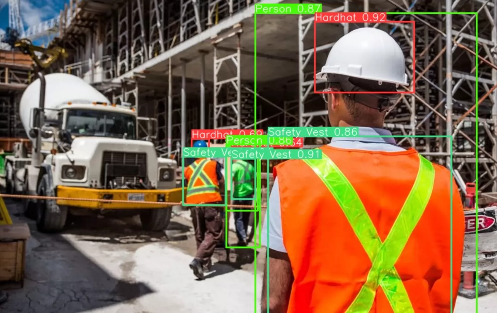
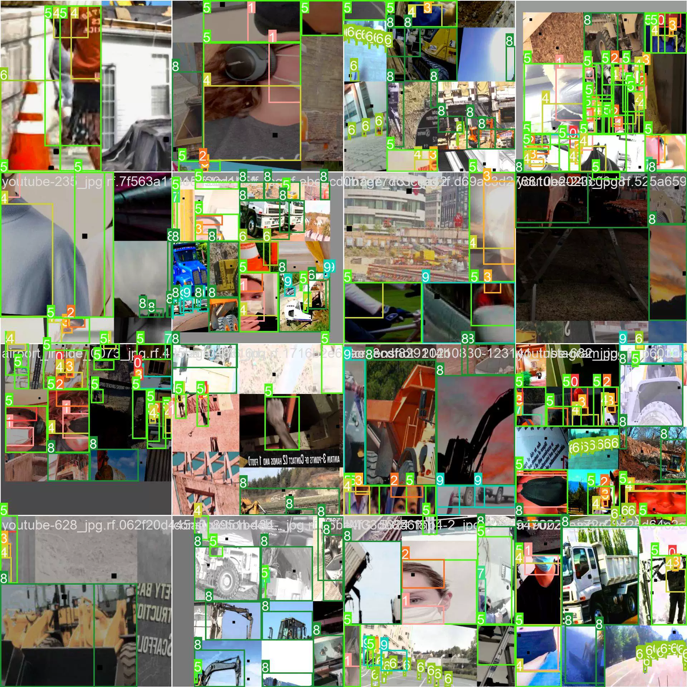

## Body

Building site safety image dataset - YOLO format with a total of 2k images, each labeled with map@0.5 and map@0.81, divided into 10 categories: 0: 'Hardhat', 1: 'Mask', 2: 'NO-Hardhat', 3: 'NO-Mask', 4: 'NO-Safety Vest', 5: 'Person', 6: 'Safety Cone', 7: 'Safety Vest', 8: 'machinery', 9: 'vehicle'
0: 'Safety hat'
1: 'Mask'
2: 'No Safety hat'
3: 'No Mask'
4: 'No Safety vest'
5: 'Person'
6: 'Safety cone'
7: 'Safety vest'
8: 'Machinery'
9: 'Vehicle'
Electronic virtual products sold are non-refundable

## Images

Here is a pay link on Stripe ( https://buy.stripe.com/3cs8yP7sY87d0vu9AB ). Please contact me lonlonago@foxmail.com after funding $89, and I will send you a complete data files , thank you!

